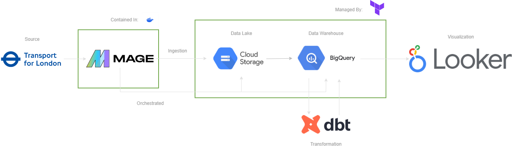
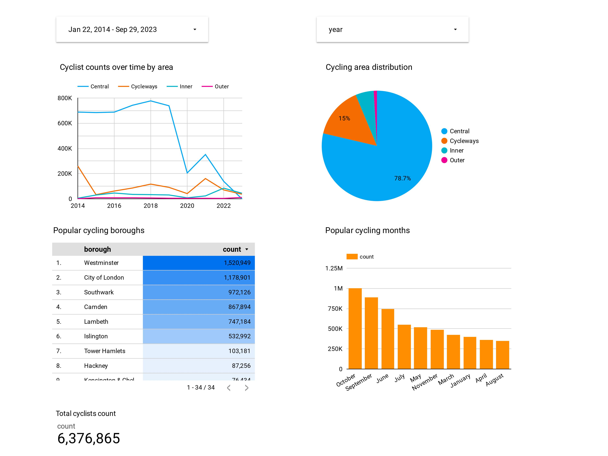

# TfL Cycling Data Engineering Project documentation

## Overview
The Active Travel Counts Programme by Transport for London (TfL) compiles historical and ongoing data on cycling, e-scooters, and pedestrian counts in London since 2014. Initially focused on monitoring cycling volumes, the programme expanded in 2022 to include counts of e-scooters and pedestrians, providing a comprehensive dataset for analysis and visualization.

The goal of this project is to build an end to end data pipeline to ingest, store, transform and visually analyze TfL cycling data. The pipeline will source its data from the TfL cycling data page (https://cycling.data.tfl.gov.uk/), ingest it using Mage and then export it to a data lake in Google Cloud Storage. The data will be transported to Google BigQuery where transformations and table joins will be performed in dbt and loaded back into BigQuery. Data visualization will then take place in a dashboard in Looker Studio.

## Technologies

- Containerization: **Docker**
- IaC: **Terraform**
- Orchestration: **Mage** 
- Data Lake: **Google Cloud Storage**
- Data Warehouse: **BigQuery**
- Transformation: **dbt**
- Data Visualization: **Looker Studio**

## Data Pipeline Architecture

# Batch ingestion
Data is separated by area (Cycleways, Central, Inner, Outer) and is batch ingested from TfL source data using Mage. A datetime column is added using the date and time columns and a deprecated SiteID that has been replaced by UnqID has it's data transferred to the UnqID column and then dropped. The cycling data is then exported in GCS partitioned by day using Mage.

# Loading to Data Warehouse
Data is loaded from GCS by area and where slight transformation take place. Column names are normalized to lowercase and underscored to replace spaces, and columns are renamed.

# Transformations
Using dbt, the four tables defined by area are given a surrogate key formed from counting period, datetime and unqid and are unioned together and joined with a reference table of monitoring locations to create a fact table of counts in all areas with the location data corresponding to the counting site.

## Data Visualization

View the Looker Studio dashboard [here](https://lookerstudio.google.com/reporting/91e140aa-d586-4d5b-a42f-43c68d5754b0).

# Reproduce Project

## Setting up virtual machine
- Create a Google Cloud Platform virtual machine and crete GCP service accounts with permissions for GCS and BQ
- Clone this directory to your VM
- Install Anaconda, Google Cloud SDK, Terraform and Docker
    - Make sure to authenticate your google service account credentials on your VM
## Terraform and Docker
- Change arguments in Terraform files
    - In variables.tf change the project id, and region to your project id and region. 
    - Also add the location of your google credentials json file, and change names of buckets/datasets to your liking
    - Run terraform init, terraform plan and terraform apply to start your GCP buckets and BQ datasets
- Run docker-compose up to start a mage instance
## Orchestration and ingestion with Mage
- Make sure to forward port 6789 to connect to mage (localhost:6789)
- Once in mage create three pipelines:
    1) One to ingest TfL data and export it to a GCS bucket
       Files are
       - Data loader: load_tfl_api.py
       - Data transformer: transform_tfl.py
       - Data exporter: upload_to_gcs.py
    2) One to extract TfL data from a GCS bucket and load it to BigQuery
       Files are
       - Data loader: load_from_gcs.py
       - Data transformer: transform_gcs_data.py
       - Data exporter: gcs_to_bq.sql
    3) One to load a reference table monitoring_locations.csv into BigQuery
       Files are
       - Data loader: load_static_table_api.py
       - Data transformer: transform_static_data.py
       - Data exporter: static_table_to_gcs.sql
- Once the pipelines are created, create a runtime variable **area** in both pipelines 1 and 2.
  - The values of the runtime variable **area** will be cycleways, central, inner, outer.

1) Run pipeline 1 each time using a different value for the **area** runtime variable
2) Run pipeline 2 each time using a different value for the **area** runtime variable
3) Run pipeline 3
- Make sure the data exists in your GCS bucket and your BigQuery dataset

## Transformations with dbt

## Setup project
- Go to dbt cloud and create a new project
  - Make sure to connect your github repository to the one containing this project
  - Subdirectory should be dbt
  - Connection should be to BigQuery
## Changing files
- Enter into the cloud cli
- Go to the dbt_project.yml and change the name under models: to be your BigQuery dataset name
- Go to the models/staging directory and inside schema.yml change the database id to your database id, and the schema to your BigQuery dataset
    - Make sure the table names match the ones in BigQuery
## Build models
- Run dbt build --vars '{'is_test_run':'false'}'
- Refresh BigQuery to find your models in the new dataset dbt created under the name {your_bigquery_dataset}_models

# Next Steps/Improvements
- Use spark to create more exploratory tables using parallization
- Use Tableau to create a concise and visually improved dashboard
